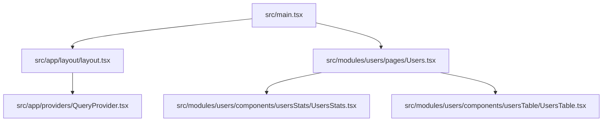
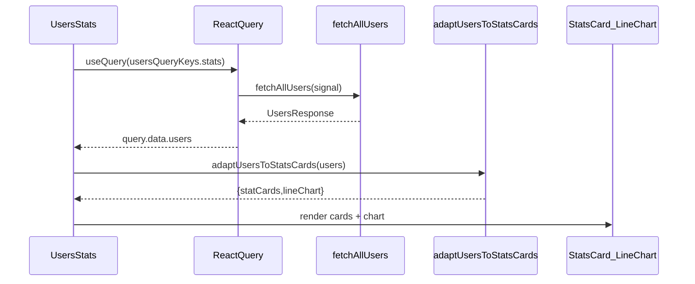
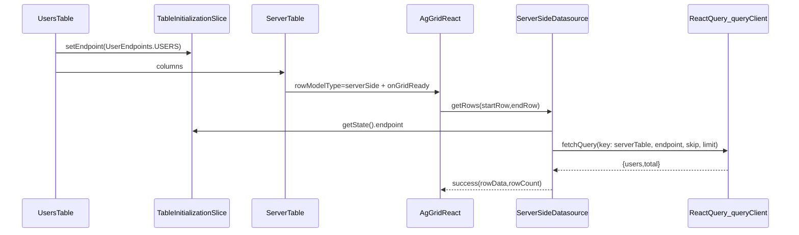

# Dashboard (Frontend)

A small dashboard app built with **Vite + React + TypeScript**, with a **Users** feature module that demonstrates:

- **UsersStats**: stats cards + line chart built from a single dataset (React Query + adapters)
- **UsersTable**: an **AG Grid server-side row model** table fed by a shared server table layer (Zustand endpoint + React Query cache)

## Tech stack

- **App**: React, TypeScript, Vite
- **Styling**: Tailwind CSS (v4), `clsx` + `tailwind-merge` (`cn()` helper)
- **Data fetching / caching**: TanStack React Query
- **Client state**: Zustand (table initialization slice)
- **Tables**: AG Grid (community + enterprise), Server-Side Row Model
- **Charts**: AG Charts
- **UI primitives**: Radix Slot (for `asChild` patterns), CVA (class-variance-authority)

## Scripts

```bash
npm install

npm run dev
npm run build
npm run preview

npm run lint
npm run format
npm run format:check
```

## Path aliases

The project uses a Vite alias:

- `@` → `src` (see `vite.config.ts`)

## Source structure

At a high level, `src/` is split into 3 layers:

- `src/app/`: **app shell**
  - `layout/`: `AppLayout` wraps the app with providers and global UI (e.g. Toaster)
  - `providers/`: global providers (currently React Query)
- `src/modules/`: **feature modules**
  - `users/`: the Users feature (API, hooks, components, adapters)
- `src/shared/`: **reusable building blocks**
  - `api/`: shared React Query client and helpers for query keys
  - `model/`: shared state slices (Zustand)
  - `ui/`: reusable UI kit components (Button, Card, Typography, ServerTable, etc.)
  - `lib/`: small utilities and stat helpers (avg/median/formatNumber/toNumber)

## App composition

The entry point renders the app layout and the Users feature:

- `src/main.tsx`
  - registers AG Grid modules (must happen before grid usage)
  - renders `AppLayout` and then `Users`



## UsersStats data flow (React Query → adapters → UI)

**Intent**: fetch the full Users dataset once, then derive UI-ready view models:

- stat cards: `adaptUsersToStats(users)`
- chart options: `usersLineChartAdapter(users)`

Key files:

- `src/modules/users/hooks/useUsersStatsCardsManager.ts`
- `src/modules/users/lib/adapters/usersStatsCards.adapter.ts`
- `src/modules/users/lib/adapters/usersStats.adapter.ts`
- `src/modules/users/lib/adapters/usersLineChart.adapter.ts`



## UsersTable data flow (Zustand endpoint → AG Grid SSRM → React Query cache)

**Intent**: keep the table generic (`shared/ui/serverTable`), and let feature modules set:

- table endpoint (Zustand slice)
- table column definitions (feature hook)

Key files:

- `src/modules/users/hooks/useUsersTableManager.ts` (sets endpoint)
- `src/modules/users/hooks/useUsersTableColumns.tsx` (defines columns + formatters)
- `src/shared/model/serverTable/useTableInitialization.slice.ts` (endpoint + init flags)
- `src/shared/ui/serverTable/hooks/usePrepareTableOptions.ts` (AG Grid options)
- `src/shared/ui/serverTable/hooks/useGetTableData.ts` (SSRM datasource + React Query fetch)



### Notes

- The endpoint for Users is currently hard-coded in `src/modules/users/api/users.types.ts`:
  - `https://dummyjson.com/users`
  - The server-side table uses `limit` and `skip` query params.

- The table uses React Query **as a cache layer** (`queryClient.fetchQuery(...)`) keyed by endpoint + pagination window.

## License

MIT — see `LICENSE`.
